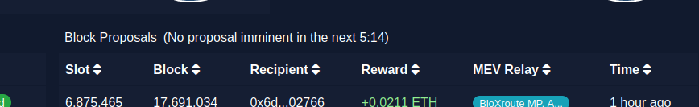
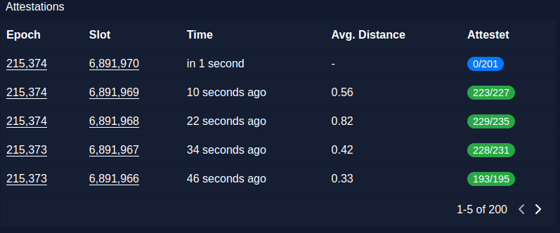
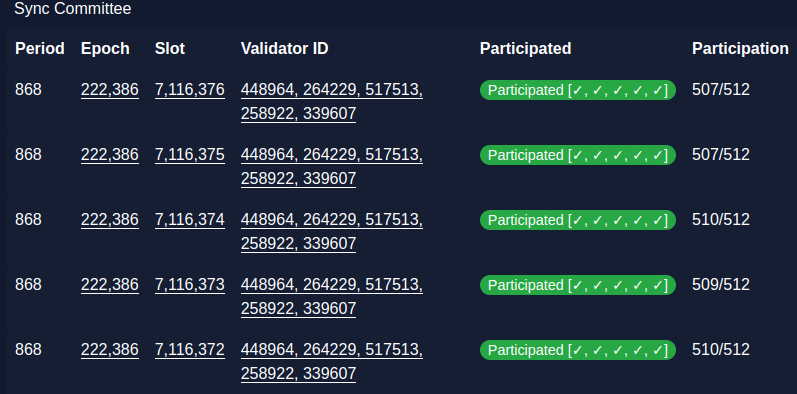
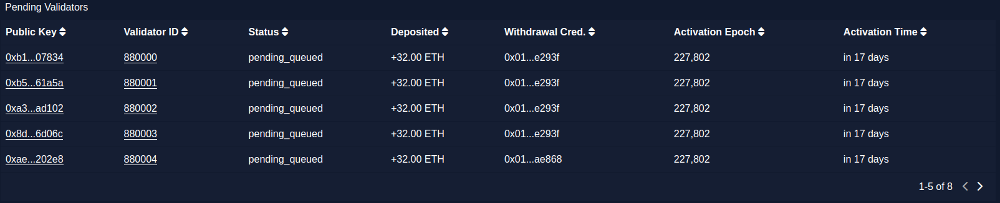

# Ethstakers.club: Your Open-Source Ethereum Beacon Chain Explorer

Welcome to the Ethstakers.club Explorer, a powerful tool designed to monitor validators, slots, epochs, and more on the Ethereum Beacon Chain. Unlike other beacon explorers, we prioritize openness and accessibility, leveraging freely available software like PostgreSQL and Chart.js. Our mission is to empower the Ethereum community by offering a transparent, open-source solution that doesn't rely on proprietary systems.

  

Unlike the competition, our explorer leverages completely freely available software, such as PostgreSQL, instead of proprietary solutions like Google Bigtable (beaconcha.in) or Chart.js instead of Highsoft charts. The project was launched with the vision that everyone should be at least able to run their own beacon chain explorer, regardless of their technical expertise or financial resources without being dependent on third parties. We believe in empowering the Ethereum community by providing an open-source and accessible solution for monitoring validators. This goal also ensures greater resilience and reliability for monitoring validators on the Ethereum Beacon Chain even in the case of unexpected events.

This project also provides benefits to researchers and individuals in need of unlimited API access. By utilizing freely available software instead of proprietary solutions, the project enables these users to easily launch a local instance. Moreover, all API functions can be effortlessly extended to accommodate any desired functionality.

## So, why was the project launched?

The Ethereum Beacon Chain is pivotal in Ethereum's transition to a proof-of-stake consensus mechanism. To ensure the network's security and integrity, validators play a crucial role.

Our Ethstakers.club Explorer was born to provide accurate, real-time information about these validators in an open, reliable manner. Traditional explorers often use expensive proprietary solutions, making them less accessible. We break down these barriers by embracing open-source software, making monitoring validators accessible to all.

## Key Features
The Ethstakers.club Explorer offers a range of features that make it a valuable tool for monitoring validators on the Beacon Chain. These features include:

### 🕒 Real-time Validator Monitoring
The explorer offers real-time (auto update) attestation and sync monitoring.

### 🗓️ Don't miss your next Proposal

  

Ensure that your validators are not scheduled for block proposals within a specific time span. The dashboard includes a feature that indicates whether any validators are expected to propose a block within the next epoch. This feature helps users stay informed about upcoming validator activities and enables them to make necessary preparations for pending duties, such as refraining from updating their clients during that time.

### 💼 Scalable Monitoring for a Multitude of Validators

Currently, there's a limit on monitoring validators, allowing up to 2,000 in total. Should you require a higher validator limit beyond this point, we invite you to reach out to us via Twitter or email. By doing so, we can accommodate an increase to the limit, potentially up to around 32,000 for your account.

Ethstakers.club has been made to facilitate effortless monitoring of an extensive pool of validators. A prime illustration of this is evident in the attestation table displayed below, seamlessly transitioning into an aggregated view when surpassing 50 validators. This enhancement significantly streamlines the process of staying informed about ongoing performance.

  

This feature extends to sync monitoring, offering a similar feature.

  

### 🕒 Keeping Tabs on Pending Validators

A table is shown when validators are pending, offering an easy method to track their shift to an active status. This feature ensures you're consistently aware of when validators are coming online.

  

### 📊 Comprehensive Validator Information
It provides comprehensive information about the validators being monitored. One of its key features is the ability to display all watched validators' information in a single table, enabling users to access and analyze the data more efficiently.

### 📈 Historical Data Analysis
The explorer stores historical data about validators, enabling users to analyze their performance over time. E.g. it offers via a chart information for all validators on the amount of missed attestation and sync committee duties. This feature helps identify trends and patterns, providing valuable insights.

### 🌐 Open-Source and Extensible
The entire project is open-source, allowing the community to contribute, review, and improve the codebase.

### 🔒 No Vendor Lock-in
By avoiding proprietary solutions, users are not locked into any specific vendor or service provider. They have the freedom to deploy and manage the explorer according to their own preferences.

### 👁️ No Tracking Tools
Ethstakers.club does not employ any third-party tracking tools such as Google Analytics.

### 📊 Aggregated Statistics
Gain a comprehensive overview of all your blocks, synch committee commitments, and access information regarding block proposals.

### 💰 Cost-Effective Solution
By leveraging freely available software like PostgreSQL, we eliminate the need for expensive proprietary solutions, making the explorer accessible to a wider range of users. The current deployment only costs ~89€ per month (51€ for beacon and execution client, 38€ for the actual explorer)

## Getting Started
For detailed instructions on how to set up and use the Eth Beacon Chain Explorer, please refer to the [documentation](docs/install.md).

## Contributing
We welcome contributions from the community to help improve the Ethstakers.club Explorer. If you have any ideas, suggestions, or bug reports, please open an issue or submit a pull request. Additionally, if you find it helpful, you have the option to star this repository. Doing so would assist us in validating that we're heading in the right direction. Please refer to the [roadmap](docs/roadmap.md) for any missing features.

